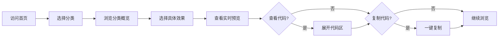
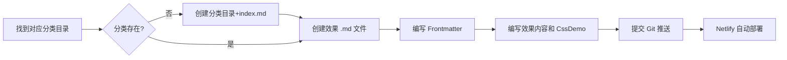
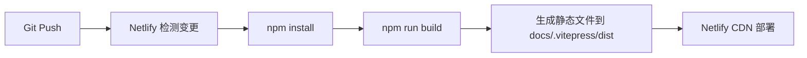

# CSS Effects Collection — 需求文档

> 版本 v1.0 | 2026-05-06

---

## 1. 项目概述

### 1.1 项目背景

前端开发者在日常工作中经常需要实现各种 CSS 交互效果（按钮悬停、渐变背景、加载动画等），但缺少一个集中化、可检索、带实时预览的效果库。常见的解决方案（CodePen、CSS-Tricks）要么是社区平台内容过载，要么是博客文章形式不便检索。

需要一个**轻量、自维护**的效果收集站点，既能自己积累沉淀 CSS 效果片段，又能方便地预览、检索和复用代码。

### 1.2 项目目标

构建一个基于 VitePress 的 CSS 效果收集与展示网站，实现以下核心目标：

| 目标 | 说明 |
|------|------|
| **效果展示** | 每个效果具备隔离的实时预览和源码展示 |
| **内容即文件** | 用 Markdown 文件管理所有效果数据，无需数据库 |
| **便捷扩展** | 新增效果只需创建 Markdown 文件，自动纳入导航 |
| **一键部署** | 内置 Netlify 部署配置，推送即上线 |

### 1.3 核心价值

- **知识沉淀**：将散落的 CSS 技巧集中管理，形成个人/团队知识库
- **即时预览**：无需离开页面即可查看效果运行态
- **风格隔离**：iframe 沙箱确保效果样式不污染页面
- **源码开放**：所有代码随文档一起管理，随时复制使用

---

## 2. 用户角色

| 角色 | 描述 | 核心场景 |
|------|------|----------|
| **效果浏览者** | 访问网站的普通用户 | 浏览效果分类、查看实时预览、复制源码 |
| **效果贡献者** | 向网站添加新效果的用户 | 编写 Markdown 文件、定义效果代码、提交到仓库 |
| **项目维护者** | 管理网站配置和部署 | 调整站点配置、管理分类、维护构建和部署 |

---

## 3. 功能需求

### 3.1 效果浏览与搜索

| 编号 | 功能 | 优先级 | 说明 |
|------|------|--------|------|
| F-01 | 分类导航浏览 | P0 | 左侧侧边栏按分类组织效果，支持折叠展开 |
| F-02 | 全文搜索 | P0 | 支持搜索效果标题和内容（VitePress 内置 local search） |
| F-03 | 首页概览 | P1 | 首页展示项目介绍、功能特性、快速入口 |
| F-04 | 分类概览页 | P1 | 每个分类有独立的概览页，列出该分类下所有效果 |

### 3.2 效果实时预览

| 编号 | 功能 | 优先级 | 说明 |
|------|------|--------|------|
| F-05 | iframe 隔离预览 | P0 | 效果在独立的 iframe 中渲染，与主页面样式完全隔离 |
| F-06 | 加载状态提示 | P0 | iframe 加载期间显示加载动画 |
| F-07 | 可配置预览高度 | P1 | 效果页面可自定义预览区域高度 |
| F-08 | 可配置预览背景 | P1 | 支持自定义预览区域背景色（浅色/深色） |

### 3.3 源码展示与复制

| 编号 | 功能 | 优先级 | 说明 |
|------|------|--------|------|
| F-09 | 展开/收起源码 | P0 | 点击按钮切换源码区域的显示和隐藏 |
| F-10 | 分段展示代码 | P0 | HTML、CSS、JavaScript 三段代码分别展示 |
| F-11 | 一键复制 | P0 | 复制全部代码到剪贴板，带复制成功反馈 |
| F-12 | 新窗口打开 | P1 | 在新的浏览器标签页中打开效果（便于完整预览） |

### 3.4 暗色/亮色主题

| 编号 | 功能 | 优先级 | 说明 |
|------|------|--------|------|
| F-13 | 主题切换 | P1 | 支持暗色/亮色模式切换（VitePress 内置） |
| F-14 | 主题适配 | P1 | 预览区域和代码区域随主题自动适配配色 |

### 3.5 内容管理

| 编号 | 功能 | 优先级 | 说明 |
|------|------|--------|------|
| F-15 | 添加新效果 | P0 | 创建 .md 文件即可添加新效果，自动纳入侧边栏导航 |
| F-16 | 添加新分类 | P0 | 创建新目录即可增加分类，侧边栏自动扫描 |
| F-17 | 效果元数据 | P0 | 每个效果通过 Frontmatter 管理标题、描述、标签、日期 |
| F-18 | 添加指南 | P1 | 提供完整的操作指南文档，包含模板和示例 |

---

## 4. 非功能需求

### 4.1 性能要求

| 编号 | 需求 | 指标 |
|------|------|------|
| NF-01 | 页面加载速度 | 首屏加载 < 2s（静态站点，无后端依赖） |
| NF-02 | 构建速度 | 全量构建 < 30s（效果数量 ≤ 100 时） |
| NF-03 | 预览渲染 | iframe 加载 < 1s（效果代码简单） |

### 4.2 样式隔离

| 编号 | 需求 | 说明 |
|------|------|------|
| NF-04 | 效果样式不污染页面 | 使用 iframe sandbox 隔离 |
| NF-05 | 页面样式不污染效果 | 效果在独立文档上下文中渲染 |
| NF-06 | 安全策略 | iframe 启用 `allow-scripts` 但不允许 `allow-same-origin` |

### 4.3 可扩展性

| 编号 | 需求 | 说明 |
|------|------|------|
| NF-07 | 新增效果无需改配置 | 自动扫描目录生成导航 |
| NF-08 | 新增分类无需改配置 | 新目录自动识别 |
| NF-09 | 组件可复用 | CssDemo 在任意 .md 文件中直接使用 |

### 4.4 可维护性

| 编号 | 需求 | 说明 |
|------|------|------|
| NF-10 | 内容与展示分离 | 效果代码在 `<script setup>` 中定义，通过 prop 传入组件 |
| NF-11 | 类型安全 | 使用 TypeScript 编写配置文件 |
| NF-12 | 构建流程标准 | 使用 VitePress 标准构建命令 |

### 4.5 部署要求

| 编号 | 需求 | 说明 |
|------|------|------|
| NF-13 | 静态站点 | 构建产物为纯静态文件，可部署在任何静态托管平台 |
| NF-14 | Netlify 部署 | 内置 `netlify.toml`，配置构建命令和发布目录 |
| NF-15 | Node.js 版本 | 构建环境需 Node.js 18+ |

---

## 5. 核心业务流程

### 5.1 浏览效果流程

### 5.2 添加效果流程

### 5.3 构建部署流程

---

## 6. 约束与假设

### 6.1 技术约束

- **构建工具**：必须使用 VitePress 作为站点生成器
- **内容格式**：所有内容以 Markdown 格式存储
- **部署目标**：以静态站点形式部署

### 6.2 设计约束

- **样式隔离**：必须使用 iframe（而非 Shadow DOM）进行效果样式隔离
- **无后端依赖**：不引入任何后端服务或数据库
- **无用户系统**：不涉及用户注册、登录、权限管理

### 6.3 假设条件

- 所有效果代码由人工编写和维护，不涉及自动抓取或生成
- 效果代码体量较小（单个效果 HTML + CSS + JS 不超过 200 行）
- 站点内容数量适中（数百级别），不需要分页或虚拟滚动
- 部署环境网络正常，能正常从 npm 安装依赖

---

## 7. 术语表

| 术语 | 说明 |
|------|------|
| **Frontmatter** | Markdown 文件顶部的 YAML 格式元数据区 |
| **CssDemo** | 核心 Vue 组件，负责 iframe 渲染和代码展示 |
| **iframe sandbox** | HTML iframe 的安全沙箱属性，限制脚本执行能力 |
| **srcdoc** | iframe 的内联 HTML 内容属性（替代 src） |
| **效果模块** | 单个 CSS 效果的完整单元，包含预览和源码 |
